# Linux sheet

## File System hierarchy
| Directory | Purpose                                          | Example Contents                     |
| --------- | ------------------------------------------------ | ------------------------------------ |
| `/bin (/usr/bin)`    | Essential user binaries (programs for all users) | `ls`, `cp`, `mv`, `bash`             |
| `/sbin (/usr/sbin)`   | Essential system binaries (mainly for root)      | `shutdown`, `ifconfig`, `mkfs`       |
| `/etc`    | System configuration files (plain text)          | `passwd`, `fstab`, `hosts`, `ssh/`   |
| `/opt`    | Optional / third-party software                  | `google/`, `skype/`                  |
| `/usr`    | User-installed software, libraries, docs         | `bin/`, `lib/`, `share/`             |
| `/tmp`    | Temporary files (cleared on reboot)              | Session data, installer caches       |
| `/var`    | Variable data that changes often                 | `log/`, `mail/`, `cache/`, `spool/`  |
| `/home`   | User home directories                            | `/home/alice`, `/home/bob`           |
| `/root`   | Root user’s home directory                       | Configs, scripts                     |
| `/boot`   | Boot loader files, kernel, initrd                | `vmlinuz`, `grub/`                   |
| `/dev`    | Device files (interfaces to hardware)            | `sda`, `null`, `tty`                 |
| `/proc`   | Virtual FS: kernel and process info              | `cpuinfo`, `meminfo`, `/proc/<pid>/` |
| `/sys`    | Virtual FS: kernel ↔ device interaction          | Driver/module info                   |
| `/lib`    | Shared libraries for essential binaries          | `libc.so`, kernel modules            |
| `/media`  | Mount point for removable devices                | `/media/usb`, `/media/cdrom`         |
| `/mnt`    | Temporary mount point (manual use)               | `/mnt/mydisk`                        |
| `/srv`    | Data for services (www, ftp, etc.)               | `/srv/ftp`, `/srv/www`               |
| `/run`    | Runtime variable data (since boot)               | PID files, sockets                   |

## Linux User Management Commands

| Action                                  | Command                                 | Notes                                          |
| --------------------------------------- | --------------------------------------- | ---------------------------------------------- |
| **Create a new user**                   | `sudo adduser <username>`               | Interactive, sets password & home dir.         |
| **Create user (minimal)**               | `sudo useradd <username>`               | Creates user, but no password/home by default. |
| **Give user root privileges**           | `sudo usermod -aG sudo <username>`      | Adds user to the `sudo` group.                 |
| **Delete a user (keep home dir)**       | `sudo deluser <username>`               | Removes user but keeps files.                  |
| **Delete a user (remove home dir too)** | `sudo deluser --remove-home <username>` | Deletes user & home directory.                 |
| **Change a user’s password**            | `sudo passwd <username>`                | Prompts for new password.                      |
| **Show all system users**               | `cat /etc/passwd`                       | Displays all users (including system users).   |
| **Show only real users**                | `cut -d: -f1 /etc/passwd`               | Extracts just usernames.                       |
| **Check currently logged-in users**     | `who` or `w`                            | Shows active sessions.                         |
| **Switch to another user**              | `su - <username>`                       | Starts a shell as another user.                |
| **Switch to root user**                 | `sudo -i` or `su -`                     | Opens a root shell.                            |

## Linux File Navigation & Directory Commands

| Action                                        | Command        | Notes                                    |
| --------------------------------------------- | -------------- | ---------------------------------------- |
| Show current working directory                | `pwd`          | Displays absolute path of where you are. |
| List files in directory                       | `ls`           | By default, hides dotfiles.              |
| List all files (including hidden)             | `ls -a`        | Shows files starting with `.`            |
| Long listing (permissions, owner, size, date) | `ls -l`        | Human-readable details.                  |
| Long listing + hidden files                   | `ls -la`       | Most commonly used.                      |
| Human-readable file sizes                     | `ls -lh`       | Size in KB/MB/GB.                        |
| Sort by modification time                     | `ls -lt`       | Newest first.                            |
| Reverse order                                 | `ls -lr`       | Combine with others (e.g. `ls -ltr`).    |
| Recursive listing                             | `ls -R`        | Lists subdirectories too.                |
| Go to another directory                       | `cd <dir>`     | Use `cd` alone to go to home.            |
| Go up one directory                           | `cd ..`        | Moves one level up.                      |
| Go back to previous directory                 | `cd -`         | Switches between last two dirs.          |
| Home directory shortcut                       | `cd ~`         | Jumps to your home dir.                  |
| Create a directory                            | `mkdir <dir>`  | Add `-p` to create nested dirs.          |
| Remove an empty directory                     | `rmdir <dir>`  | Only works if dir is empty.              |
| View disk usage of directory                  | `du -sh <dir>` | Human-readable size.                     |
| Show disk usage of filesystem                 | `df -h`        | Mounted partitions usage.                |


### ls Options Reference

| Option           | Meaning                                                  | Example           |
| ---------------- | -------------------------------------------------------- | ----------------- |
| `ls`             | List files (excluding hidden)                            | `ls`              |
| `-a`             | Show all (including hidden `.` files)                    | `ls -a`           |
| `-l`             | Long listing format (permissions, ownership, size, time) | `ls -l`           |
| `-h`             | Human-readable sizes (with `-l`)                         | `ls -lh`          |
| `-r`             | Reverse order of sorting                                 | `ls -lr`          |
| `-t`             | Sort by modification time (newest first)                 | `ls -lt`          |
| `-S`             | Sort by file size                                        | `ls -lS`          |
| `-X`             | Sort alphabetically by extension                         | `ls -lX`          |
| `-R`             | Recursive list (include subdirs)                         | `ls -R`           |
| `-d */`          | Show only directories                                    | `ls -d */`        |
| `-1`             | One file per line                                        | `ls -1`           |
| `-i`             | Show inode numbers                                       | `ls -i`           |
| `-F`             | Append `/` to dirs, `*` to executables                   | `ls -F`           |
| `-G` / `--color` | Enable colors for file types (if supported)              | `ls --color=auto` |

### File Search in Linux
| Action                              | Command                                     | Notes                            |
| ----------------------------------- | ------------------------------------------- | -------------------------------- |
| Find by filename                    | `find /path -name "file.txt"`               | Case-sensitive search.           |
| Find by filename (case-insensitive) | `find /path -iname "file.txt"`              | Ignores case.                    |
| Find by extension                   | `find /path -name "*.log"`                  | Matches all `.log` files.        |
| Find by multiple patterns           | `find /path -name "*.jpg" -o -name "*.png"` | OR condition.                    |
| Find only directories               | `find /path -type d -name "config"`         | Use `-type d`.                   |
| Find only files                     | `find /path -type f -name "*.sh"`           | Use `-type f`.                   |
| Find by size                        | `find /path -size +100M`                    | Files larger than 100MB.         |
| Find by modified time (last 7 days) | `find /path -mtime -7`                      | `-mtime +7` = older than 7 days. |
| Find by access time (last 1 day)    | `find /path -atime -1`                      | Time since last access.          |
| Find empty files/dirs               | `find /path -empty`                         | Useful for cleanup.              |
| Execute command on results          | `find /path -name "*.tmp" -exec rm {} \;`   | Deletes all `.tmp` files.        |
| Limit depth of search               | `find /path -maxdepth 1 -type f`            | Only in top-level dir.           |

### locate Command (fast, database-based)
| Action                                            | Command                 | Notes                                     |
| ------------------------------------------------- | ----------------------- | ----------------------------------------- |
| Find file quickly                                 | `locate file.txt`       | Uses a prebuilt database.                 |
| Case-insensitive search                           | `locate -i file.txt`    | Ignores case.                             |
| Show count of matches                             | `locate -c file.txt`    | Only count results.                       |
| Limit output to first 10 results                  | `locate -n 10 file.txt` | Prevents long output.                     |
| Refresh database (needed after new files created) | `sudo updatedb`         | Updates `/var/lib/mlocate/mlocate.db`.    |
| Search for partial name                           | `locate docu`           | Matches `document.txt`, `docutils/`, etc. |

- Use find when you need precision and real-time results.
- Use locate when you just need a fast filename search.

## Wildcard Characters in Linux
Wildcards are special characters used to match multiple files or patterns in commands like ls, cp, mv, rm, find, etc.

### 🔹 Basic Wildcards
| Wildcard         | Meaning                                           | Example             | Matches                                         |
| ---------------- | ------------------------------------------------- | ------------------- | ----------------------------------------------- |
| `*`              | Matches **zero or more characters**               | `ls *.txt`          | `a.txt`, `notes.txt`, `report1.txt`             |
| `?`              | Matches **exactly one character**                 | `ls file?.txt`      | `file1.txt`, `fileA.txt` (but not `file12.txt`) |
| `[ ]`            | Matches **any one character inside brackets**     | `ls file[123].txt`  | `file1.txt`, `file2.txt`, `file3.txt`           |
| `[! ]` or `[^ ]` | Matches **any one character NOT inside brackets** | `ls file[!0-9].txt` | `fileA.txt`, `fileX.txt` (but not `file1.txt`)  |

### 🔹 Character Ranges
| Wildcard   | Meaning                  | Example            | Matches                    |
| ---------- | ------------------------ | ------------------ | -------------------------- |
| `[a-z]`    | Any lowercase letter     | `ls [a-z]*`        | `apple`, `banana`, `zebra` |
| `[A-Z]`    | Any uppercase letter     | `ls [A-Z]*`        | `File`, `Test`, `Zoo`      |
| `[0-9]`    | Any digit                | `ls file[0-9].txt` | `file1.txt`, `file9.txt`   |
| `[a-zA-Z]` | Any letter (upper/lower) | `ls [a-zA-Z]*`     | `dog`, `Cat`, `Zoo`        |
| `[0-9a-f]` | Hex characters           | `ls *[0-9a-f]`     | `data1`, `filea`, `logf`   |

### 🔹 Advanced Patterns
| Wildcard       | Meaning                                                                                       | Example                | Matches                                        |
| -------------- | --------------------------------------------------------------------------------------------- | ---------------------- | ---------------------------------------------- |
| `{ }`          | Brace expansion → generate multiple patterns                                                  | `ls {file1,file2}.txt` | `file1.txt`, `file2.txt`                       |
| `{start..end}` | Brace expansion with sequence                                                                 | `echo {1..5}`          | `1 2 3 4 5`                                    |
| `**`           | Matches files/directories recursively (**if enabled with `shopt -s globstar` in Bash ≥ 4.0**) | `ls **/*.txt`          | Finds all `.txt` under current dir and subdirs |


### File Creation with Wildcards (via brace expansion)
| Command                | What it does                | Example Result                                      |
| ---------------------- | --------------------------- | --------------------------------------------------- |
| `touch file{1..5}.txt` | Create numbered files       | `file1.txt file2.txt file3.txt file4.txt file5.txt` |
| `touch {a,b,c}.log`    | Create multiple named files | `a.log b.log c.log`                                 |
| `mkdir project_{A..C}` | Create multiple directories | `project_A project_B project_C`                     |
| `cp file.txt{,.bak}`   | Create a backup copy        | `file.txt` and `file.txt.bak`                       |

### File Deletion with Wildcards
| Command         | What it does                                       | Example                                                 |
| --------------- | -------------------------------------------------- | ------------------------------------------------------- |
| `rm *.tmp`      | Delete all `.tmp` files in current dir             | Removes `a.tmp`, `b.tmp`                                |
| `rm file?.txt`  | Delete files with exactly 1 character after "file" | Removes `file1.txt`, `fileA.txt` (but not `file12.txt`) |
| `rm [0-9]*.log` | Delete `.log` files starting with a digit          | Removes `1.log`, `2025.log`                             |
| `rm -r test*`   | Delete all dirs/files starting with `test`         | Removes `test1/`, `testcase.txt`                        |

**Be careful with rm + wildcards!**
- Always run ls first to confirm matches:
```bash
ls *.tmp
```

- Use -i option for interactive deletion:
```bash
rm -i *.tmp
```

### File Types Overview
| Symbol (ls -l) | Type                      | Description                                        | Example                   |
| -------------- | ------------------------- | -------------------------------------------------- | ------------------------- |
| `-`            | **Regular file**          | Contains data (text, binary, images, executables). | `/etc/passwd`, `/bin/ls`  |
| `d`            | **Directory**             | A folder containing files and other directories.   | `/home/`, `/etc/`         |
| `l`            | **Symbolic (soft) link**  | Pointer to another file/directory.                 | `/lib -> /usr/lib`        |
| `c`            | **Character device file** | Device that transfers data character by character. | `/dev/tty`, `/dev/random` |
| `b`            | **Block device file**     | Device that transfers data in blocks (storage).    | `/dev/sda`, `/dev/loop0`  |
| `p`            | **Named pipe (FIFO)**     | Enables inter-process communication (FIFO queue).  | `/tmp/mypipe`             |
| `s`            | **Socket**                | Used for inter-process or network communication.   | `/run/docker.sock`        |


### 🔹 Commands to Identify File Types
| Command           | Purpose                                               | Example                                    |                              |   |
| ----------------- | ----------------------------------------------------- | ------------------------------------------ | ---------------------------- | - |
| `ls -l`           | Shows file type in the first character of permissions | `-rw-r--r-- file.txt` → `-` = regular file |                              |   |
| `file <filename>` | Displays the file’s actual type (content-based)       | `file a.out` → ELF 64-bit executable       |                              |   |
| `stat <filename>` | Detailed file info including type, size, inode        | `stat /etc/passwd`                         |                              |   |

### 🔹 Example ls -l
```bash
$ ls -l
-rw-r--r--  1 alice alice   1200 Sep 25 10:30 notes.txt      # Regular file
drwxr-xr-x  2 alice alice   4096 Sep 25 10:31 projects       # Directory
lrwxrwxrwx  1 alice alice     11 Sep 25 10:32 lib -> usr/lib # Symbolic link
crw-rw-rw-  1 root  tty     5, 0 Sep 25 10:33 /dev/tty       # Character device
brw-rw----  1 root  disk    8, 0 Sep 25 10:34 /dev/sda       # Block device
prw-r--r--  1 alice alice      0 Sep 25 10:35 mypipe         # Named pipe
srwxr-xr-x  1 root  root       0 Sep 25 10:36 docker.sock    # Socket
```

### Character Device vs Block Device

`Character Device (c)`
- Sends/receives data one character (byte) at a time.
- Slower (byte-by-byte)
- For devices like keyboard, mouse, serial ports
- **Example:** /dev/tty, /dev/random

`Block Device (b)`
- Sends/receives data in blocks (chunks)
- Faster (block access, buffering)
- For devices like hard drives, SSDs, USBs
- **Example:** /dev/sda, /dev/nvme0n1

### Named Pipe vs Socket

`Named Pipe`
- One-way (half-duplex)
- Exists as a special file in filesystem (/tmp/mypipe)
- Works between processes on the same machine

`Block Device (b)`
- Two-way (full-duplex)
- Exists as a file, but mainly used for process-to-process or network communication
- Works between processes on the same machine or across network

## Soft and hard links

`Hard Link`

- A hard link is another name for the same file.
- Both the original file and the hard link point to the same inode (same data on disk).
- Deleting the original file does not delete the data as long as one hard link remains.
- Restrictions:
    - Can’t link directories.
    - Can’t cross filesystems/partitions.

```bash
ln sourcefile.txt hardlink.txt ## both the file has to be on same partition of disk
```

`Soft Link`

- A soft link is like a shortcut (pointer) to another file’s path.
- It has its own inode, which just stores the target filename
- If the original file is deleted, the soft link becomes broken (dangling).
- Can point to:
    - Files or directories
    - Across filesystems/partitions

```bash
ln -s sourcefile.txt softlink.txt
```



```mermaid
graph TD
    subgraph Hard_Link
        F1[file.txt]
        HL[hardlink.txt]
        IN1[inode#1001 → Data Blocks]
        F1 --> IN1
        HL --> IN1
    end

    subgraph Soft_Link
        F2[file.txt]
        SL[softlink.txt]
        IN2[inode#2002 → Data Blocks]
        F2 --> IN2
        SL --> F2
    end
```

## linux command syntax
**commands typically have the syntax:**
```
command option(s) arguments(s)
```

**options**
- modify the way command works.
- usually consist of hyphen or dash followed by a single letter.
- some commands accept multiple options which can usually be grouped together after a single hyphen.

**arguments**
- most commands are used together with one or more arguments.
- some commands assume a default argument if none is supplied.
- arguments are optional for some commands and required by others.

`Example`
`cp` (copy files)
```bash
cp -r Documents Backup 
# cp → command 
# -r → option (recursive, copy directories)
# Documents Backup → arguments (source and destination)
```

## File Permissions

Linux is a multi-user system, so file permissions control who can read, write, or execute files and directories.

### 1. Permission Types
Each file/directory has three basic permissions:
- r (read) → view contents of a file, list files in a directory
- w (write) → modify a file, create/delete files in a directory
- x (execute) → run a file as a program/script, enter a directory

### 2. Permission Groups
Permissions are assigned to three categories:
- User (u) → the file’s owner
- Group (g) → members of the file’s group
- Others (o) → everyone else on the system

### 3. Viewing Permissions
```bash
$ ls -l
-rwxr-xr-- 1 alice developers 120 Sep 26 10:00 script.sh
```

**Breakdown:**

- `→` file type (`-` = file, `d` = directory, `l` = link, etc.)
- `rwx` → user (owner) permissions
- `r-x` → group permissions
- `r--` → others permissions
- `alice` → file owner
- `developers` → group

**So:**

- `Owner` (alice) → read, write, execute
- `Group` (developers) → read, execute
- `Others` → read only

### 4. Changing Permissions
Using chmod (change mode)

- Add/Remove permissions
```bash
chmod u+x script.sh    # add execute for user
chmod g-w script.sh    # remove write for group
chmod o+r script.sh    # add read for others    
chmod a-x script.sh    # remove execute for all
```
- Set exact permissions with numbers (octal notation)
```bash
chmod 755 script.sh

# Breakdown:
# 7 = rwx (4+2+1) (for user)
# 5 = r-x (4+0+1) (for group)
# 5 = r-x (4+0+1) (for others)
```

### Numeric File Permissions (Octal Notation)
| Number | Binary | Permission | Meaning                |
| ------ | ------ | ---------- | ---------------------- |
| **0**  | 000    | `---`      | No permission          |
| **1**  | 001    | `--x`      | Execute only           |
| **2**  | 010    | `-w-`      | Write only             |
| **3**  | 011    | `-wx`      | Write + Execute        |
| **4**  | 100    | `r--`      | Read only              |
| **5**  | 101    | `r-x`      | Read + Execute         |
| **6**  | 110    | `rw-`      | Read + Write           |
| **7**  | 111    | `rwx`      | Read + Write + Execute |


**To cd to a directory we must have executable right to dir**

### 5. Changing Ownership
- Change the owner:
```bash
chown bob file.txt
```

- Change the group:
```bash
chgrp developers file.txt
```

- Change both:
```bash
chown bob:developers file.txt
```

## Access Control list (ACL)
ACLs let you give more fine-grained permissions than the standard Linux permissions (owner, group, others).
- Linux files have permissions like rwx for owner, group, and others.
- Sometimes, you want to allow specific users or groups different permissions than these default ones.
- ACL lets you do that.

---

**View ACL of a file**
```bash
getfacl filename
```

```bash
# Example output

# file: test.txt
# owner: user1
# group: staff
user::rw-
user:user2:r--
group::r--
mask::r--
other::r--
```

**Set ACL for a user**
```bash
# -m → modify ACL
setfacl -m u:username:permissions filename

# Example
setfacl -m u:john:rw test.txt
``` 

**Set ACL for a group**
```bash
setfacl -m g:groupname:permissions filename

# Example
setfacl -m g:editors:rwx test.txt
```

**Remove ACL entry**
```bash
setfacl -x u:john filename
```

**Default ACLs for directories**
```bash
# You can give ACLs to new files created inside a directory.
setfacl -d -m u:john:rw /mydir
```

**Check ACL of a directory**
```bash
getfacl /mydir
```

**To remove all entries**
```bash
setfacl -b path/to/file # for all users
```

`Note:`
- As you assign the ACL permission to a file/directory it adds + sign at the end of the permission.
- Setting w permission with ACL does not allow to remove a file.
